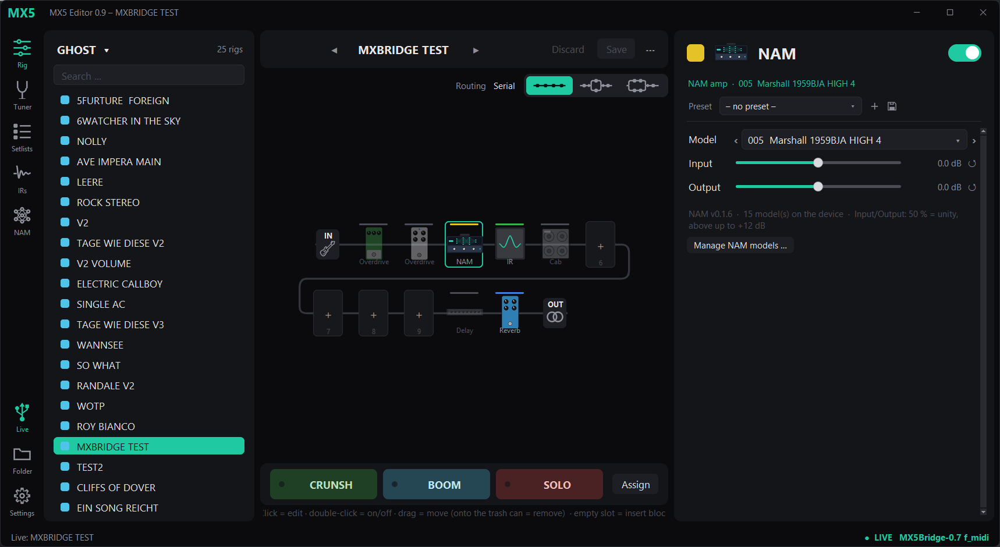

# MX5 Bridge + MX5 Editor (with NAM-Mod Support)

**Unofficial** tooling for the **HeadRush MX5** guitar processor:

- **MX5 Bridge**: a small add-on to the stock MX5 firmware 2.7. It gives the device's internal
  parameter tree, its rig database and its files to a computer over **USB-MIDI (SysEx)**.
- **MX5 Editor**: a desktop editor for Windows that uses the bridge. It works like the
  HeadRush web editor, but **live**: every change is heard on the device right away, and changes
  made on the device show up in the editor.



> **Not affiliated with HeadRush or inMusic.** HeadRush is a trademark of inMusic Brands.
> Installing modified firmware is **at your own risk**. Read [INSTALL.md](INSTALL.md) first,
> especially the part about getting back to the stock firmware.

## What the editor can do

- **Signal chain**: add, remove and move blocks with drag & drop. Pick the routing
  (serial / parallel), double amps, cabs and IRs, and switch blocks on/off. Model picker with
  an icon for every amp, cab and effect.
- **All parameters** of every block, with the labels the device uses for each amp model.
  Load **block presets**, and save your own or overwrite them.
- **Rigs**: All Rigs and setlists in device order. Load, save, *save as new*, rename, colour,
  program numbers, delete. There is also a **setlist manager** (drag & drop, banks of three,
  numbering).
- **Footswitches, scenes and pedals**: scene/toggle mode, labels, colours, which blocks a scene
  switches and which preset it loads, toggle assignments, expression pedal targets and ranges,
  and rig tempo.
- **Impulse responses**: upload, rename, delete and organise IR files, and audition them while
  browsing.
- **Tuner** and **input/output level meters**.
- **Backup / restore** of everything (rigs, setlists, block presets) as the same `.rig`,
  `.setlist` and `.block` files the MX5 writes in USB transfer mode.
- **Offline mode**: edit `.rig` files from a backup without the device.
- **Optional NAM support**: works together with the
  [HeadRush NAM mod by lolgab](https://github.com/lolgab/headrush-nam-mod). It manages NAM
  models and shows NAM blocks as amps. Turning NAM off and on needs a restart of the device app.
- Reconnects on its own when the device restarts or the cable is pulled.

## What the bridge adds to the device

- A USB-MIDI port **"HeadRush MX5"** next to the stock USB audio.
- SysEx commands to read and write any property (`/Engine/Patch/...`), run small scripts in the
  device's QML engine, and query or modify the rig database (SQLite).
- **Safety**: the bridge backs up the rig database automatically before the first write after
  each boot. It has a crash guard: after three app crashes in a row it restores that backup (with
  NAM: it switches NAM off first). The stock rig database is never replaced wholesale.
- File access for impulse responses and NAM models.

Developers: the protocol is described in [docs/PROTOCOL.md](docs/PROTOCOL.md), and
[`editor/bridge.py`](editor/bridge.py) is a small Python client for it.

## How the firmware is distributed

This project **does not ship any HeadRush firmware**. The **patcher** works like the NAM mod
installer:

1. It downloads the **official** HeadRush MX5 2.7 updater from inMusic's server (or uses a copy
   you already have).
2. It adds the bridge files to that firmware **on your computer**.
3. It writes a ready-to-run updater folder that uses HeadRush's own `FirmwareUpdater.exe`.

The patcher is plain Python with no extra packages. It does not need Linux or WSL. It also
accepts an updater made by the NAM mod's installer, so you can have both.

## Quick start

Full instructions: **[INSTALL.md](INSTALL.md)**.

1. Install [Python 3](https://www.python.org/downloads/) (Windows: tick *Add python.exe to PATH*).
2. Download both zips from the [latest release](../../releases/latest).
3. Firmware: unzip `MX5Bridge_0.7_Patcher.zip`, run `Patch_Firmware.bat`, then run the
   `FirmwareUpdater.exe` it creates while the MX5 is in firmware update mode.
4. Editor: unzip `MX5Editor_0.9.zip`, then run `pip install mido python-rtmidi pillow` once.
   Start the editor with `MX5Editor_starten.bat`.

## Requirements

| | |
|---|---|
| Device | HeadRush **MX5** with firmware **2.7** (other HeadRush models are not supported) |
| Computer | Windows 10/11. The editor uses Windows-only window code. The patcher itself also runs on Linux/macOS if `7z` or `bsdtar` is installed |
| Python | 3.9 or newer. Editor: `mido`, `python-rtmidi`, `pillow` |

## Repository layout

```
editor/            MX5 Editor (Python/tkinter) + bridge.py client
editor/werkzeuge/  test program, regression test, catalog builder (developer tools)
firmware/          bridge firmware: patcher, device files (mod/), build scripts
docs/PROTOCOL.md   SysEx protocol and useful device property paths
```

Source comments and developer tool output are mostly in German. The editor UI, the patcher and
the docs are in English.

## Status

The project was developed and tested on one MX5 against firmware 2.7, with an automated
regression test (`editor/werkzeuge/regressionstest.py`, 30 steps) that runs against the real
device. It is a hobby project: expect rough edges, and keep a backup of your rigs
(*⋯ › Back up everything* in the editor).

## Credits & licences

- MX5 Bridge and MX5 Editor: [MIT licence](LICENSE).
- [`firmware/bin/sqlite3`](firmware/bin): a static ARM build of [SQLite](https://sqlite.org)
  (public domain), built with `firmware/tools/build-sqlite3.sh`.
- NAM support uses the [HeadRush NAM mod](https://github.com/lolgab/headrush-nam-mod) by lolgab
  (GPLv3). It is **not included**: the NAM mod's own installer or `firmware/tools/nam-mod.sh`
  fetches it from its repository.
- The model icons are original flat drawings, not HeadRush artwork.
